# STACKMATE — 100% VIBECODED Chess Puzzle Pools on Stacks

A bold, neo‑brutalist, on‑chain chess puzzle arena where players stake STX, race to solve curated puzzles, and the fastest correct solver wins the prize pool. Built end‑to‑end on Stacks with a production‑grade UI, transparent on‑chain logic, and a vibe that refuses to be ignored.

This submission is crafted for the DoraHacks Stacks Vibe Coding Hackathon — it's 100% Vibecoded: loud design, delightful interactions, and serious tech under the hood.

## TL;DR
- Stake STX to enter a puzzle matching your difficulty.
- Solve the puzzle as fast as you can.
- Leaderboard updates live; after the deadline, the fastest correct solver claims the prize pool (minus a 5% platform fee).
- Fully on‑chain puzzle lifecycle: create → enter → submit solution → set winner → claim prize → stats.
- Neo‑brutal UI: thick borders, hard shadows, BIG type, rotation, confetti, and segmented LED timers.

## Why Stackmate Wins This Hackathon
1. Pure vibe: 100% VIBECODED. We didn't just ship features — we shipped a feeling. The UI is memorable, emotive, and proudly neo‑brutalist.
2. End‑to‑end product: Smart contract + wallet flows + live leaderboard + polished UX + docs. Not a demo — a complete experience.
3. Real Stacks integration: Leather/Xverse/Hiro wallet support, robust contract reads/writes, indexer‑backed insights.
4. On‑chain transparency: Prize pools, deadlines, entries, correctness, winner and claims are all verifiable on‑chain.
5. Social flywheel: Live leaderboards, share actions, notifications, achievements — built‑in retention loops.
6. Designed for scale: Difficulty tiers, modular components, typed API layer, resilient data fetching.
7. Technical quality: Strong TS types, React Query, framer‑motion micro‑interactions, clean contract boundaries.
8. Fair economics: Simple, predictable 5% platform fee; everything else goes to players. Clear incentives for tournament operators.
9. Extensible: New game modes, tournament formats, NFT sponsorships, or oracles can be added without rewriting the core.
10. It's fun. People will actually want to play this — and the vibe sells itself.

## Demo Overview
- Home: Browse active puzzles, difficulty tiers, prize pools, entries, countdown.
- Puzzle: Standalone viewer with info card and solver integration.
- Solve: Core experience — high‑contrast board, LED timer, hint/reset, live leaderboard, confetti.
- Leaderboard: All‑time champions + today's best times + hall of fame.
- Profile: Stats grid, achievements, win‑rate chart, sortable history with pagination.
- My Wins: Claim prizes with a celebration modal.

## Architecture

### High‑Level
- Frontend: React 19 + Vite + TypeScript + Tailwind + framer‑motion + React Query.
- Stacks: Clarity contract (puzzle‑pool.clar), Hiro API for indexer support, @stacks/transactions for reads/writes.
- Wallets: Leather, Xverse, Hiro — with network switcher (testnet/mainnet).
- Data: Contract read‑only calls for puzzle metadata and stats. Leaderboard assembled from on‑chain transactions plus read‑only calls for correctness.

### Key Frontend Libraries
- React 19, Vite, TypeScript
- Tailwind CSS (with custom neo‑brutal theme)
- framer‑motion (spring physics for micro‑interactions)
- React Query (@tanstack/react‑query)
- @stacks/transactions, @stacks/network

### Project Structure
```
contract/                   Clarity smart contract (puzzle-pool.clar)
src/
  components/
    neo/                    Neo‑brutal UI kit (Button, Card, Modal, Badge, Input)
    skeletons/              Loading states
    ChessPuzzleSolver.tsx   Core chess interaction
    LiveLeaderboard.tsx     Real‑time leaderboard widget
    CountdownTimer.tsx      Segmented LED timer
    Header.tsx, WalletConnect.tsx, NotificationBell.tsx, ...
  pages/
    Home.tsx, SolvePuzzle.tsx, Leaderboard.tsx, Profile.tsx, MyWins.tsx, Puzzle.tsx
  lib/                      Stacks utils, contracts API, chess logic, time utils
  hooks/                    Wallet + blockchain hooks
styles/                     Neo‑brutal theme configuration
scripts/                    Data, verification and analysis helpers
```

## Components Diagram



## Routes

The application uses React Router for navigation. Here are all the defined routes:

- **/** - Home page (puzzle selection and entry)
- **/puzzle/:id** - Individual puzzle details page
- **/solve/:difficulty/:puzzleId** - Puzzle solving interface
- **/wins** - My Wins page (claim prizes)
- **/profile** - User profile and stats
- **/leaderboard** - Global leaderboard

## Smart Contract (Clarity) — puzzle‑pool.clar

A minimal, auditable contract powering on‑chain puzzle tournaments.

### Core Data
- puzzles: id → { difficulty, prize‑pool, solution‑hash, deadline, winner?, is‑active, entry‑count, stake‑amount }
- entries: { puzzle‑id, player } → { solve‑time, timestamp, is‑correct }
- user‑stats: address → { total‑entries, total‑wins, total‑winnings }
- user‑puzzle‑list: address → [puzzle‑ids]
- active‑puzzle‑list: id → bool
- difficulty‑stakes: difficulty → stake amount (µSTX)

### Key Constants
- platform‑fee‑percent = 5%

### Public Functions
- set‑difficulty‑stake(difficulty, stake): owner config per tier
- create‑puzzle(difficulty, solution‑hash, deadline): owner creates a puzzle
- enter‑puzzle(puzzle‑id): user stakes to enter; prize pool increments
- submit‑solution(puzzle‑id, solution, solve‑time): store correctness + time
- set‑winner(puzzle‑id, winner): owner sets winner after deadline; must be correct
- claim‑prize(puzzle‑id): winner claims prize (prize‑pool minus 5% platform fee)
- emergency‑refund(puzzle‑id, participants): owner refunds all if no winner
- update‑platform‑address(new‑address)

### Read‑only Functions
- get‑puzzle‑info, get‑entry, get‑user‑stats, get‑user‑entries, get‑puzzle‑count
- get‑platform‑address, is‑puzzle‑active, get‑difficulty‑stake‑amount

### Fairness & Transparency
- The canonical truth lives on‑chain: entry counts, deadlines, prize pool, correctness, final winner, and claims.
- The UI's live leaderboard is built from on‑chain `submit-solution` calls. Because `set-winner` requires a correct entry, adjudication is transparent and verifiable. (The MVP uses an admin‑set winner gated by correctness; future versions can move to fully trustless winner selection or commit‑reveal time proofs.)

## UX & Design — 100% VIBECODED
- Neo‑brutal visuals: thick 4–8px black borders, hard 8px shadows, clashing electric colors.
- BIG type: Space Grotesk 900 for headers; JetBrains Mono 900 for numbers.
- Segmented LED timers with glow; ranking circles; medal icons; pulsing badges; confetti showers.
- Intentional rotation (1–3°), hover lift, and spring physics across the app.
- Accessibility: high contrast, readable type scale, all interactions keyboard‑reachable.

## Local Setup

### Prerequisites
- Node.js ≥ 20
- A Stacks wallet (Leather/Xverse/Hiro)

### 1) Install
```
npm install
```

### 2) Configure Environment
Create `.env.local` in project root:
```
VITE_CONTRACT_TESTNET=ST2QK4128H22NH4H8MD2AVP72M0Q72TKS48VB5469.puzzle-pool
VITE_CONTRACT_MAINNET=SPXXXXXXXXXXXXXXXXXXXXXXXXXXXXXXXXXXXX.puzzle-pool
```
- Use the exact `address.contractName` format.
- Testnet addresses start with `ST…`, mainnet with `SP…`.

### 3) Run Dev Server
```
npm run dev
```
Visit http://localhost:5173 and connect your wallet.

### 4) Switch Networks
Use the wallet dropdown to toggle Testnet/Mainnet. The app selects the corresponding contract ID automatically.

## How to Operate a Tournament

1) Set Stake Amounts (owner)
```
(set-difficulty-stake "beginner" u1000000)       ;; 1 STX
(set-difficulty-stake "intermediate" u5000000)   ;; 5 STX
(set-difficulty-stake "expert" u10000000)        ;; 10 STX
```

2) Create Puzzle (owner)
- Compute a 32‑byte `solution-hash` off‑chain (e.g., SHA‑256 of the canonical solution string).
- Choose a future `deadline` block height.
```
(create-puzzle "expert" 0x<32-bytes> u<deadline>)
```

3) Players Enter
- Users call `enter-puzzle` and stake the difficulty's amount; prize pool grows automatically.

4) Submit Solutions
- Users call `submit-solution(puzzle-id, solution, solve-time)`.
  - Contract checks `solution` against `solution-hash` and stores correctness + declared time.
  - UI builds a live leaderboard from these transactions.

5) Close & Select Winner (owner)
- After the deadline, choose the fastest correct solver and call `set-winner`.
  - This is verifiable on‑chain through the stored entries.

6) Winner Claims Prize
- Winner calls `claim-prize` to receive prize‑pool minus 5% platform fee.

7) Emergency Refund
- If no correct solvers, owner can refund all participants with `emergency-refund`.

## Product Features (Highlights)
- Difficulty tiers (Beginner / Intermediate / Expert) with independent stake amounts.
- Live Leaderboard with medal icons and YOU highlighting.
- Chess solver with hint penalties, move tracking, and celebratory states.
- Achievements & stats: win rate, best time, streaks, totals.
- Share actions for wins and solves.
- Notifications panel with desktop support.

## API & Indexer Notes
- Read‑only: `/v2/contracts/call-read` for puzzle and user stats.
- Chain info: `/v2/info` for block height (countdowns, deadlines).
- Leaderboard indexing: contract call history for `submit-solution` via Hiro API.

## Security Considerations (MVP → Production)
- MVP adjudication: `set-winner` is owner‑gated but correctness‑guarded. All data is public and verifiable.
- Future: 
  - Trustless winner selection (e.g., on‑chain min reduction over bounded set or a provable reduction off‑chain with merkle proofs).
  - Commit‑reveal + time proofs; per‑move hashing; or zk‑assisted verification.
  - Rate limiting and DoS protection on read‑paths.

## Roadmap
- Full trustless winner selection.
- Season ladders, leagues, and squads.
- Sponsorships & themed tournaments.
- NFT cosmetics for boards, pieces, and badges.
- On‑chain governance for fee splits and curation.
- Mobile‑first progressive web app (PWA) with offline modes for practice.

## Development Scripts
- `scripts/build-puzzles.mjs` — curate/generate puzzle sets.
- `scripts/verify-puzzles.mjs` — sanity checks on puzzle data.
- `scripts/analyze.mjs` — contract/puzzle analytics helpers.

## Contributing
PRs welcome. Please:
- Keep the vibe: thick borders, hard shadows, hard edges.
- Maintain type safety and consistent React Query patterns.
- Do not log secrets or wallet data.

## License
MIT — see LICENSE if present. If absent, assume all rights reserved for hackathon evaluation purposes.

## Credits
- Chess logic powered by `chess.js` and `react-chessboard`.
- Built with ❤️ for Stacks by vibecoders.

---
# Appendix: Judging Criteria Mapping

- Innovation & Originality — A familiar game, radically reimagined for Web3 with a distinctive, 100% vibecoded brand.
- Technical Depth — Real smart contract, fully wired UI, robust data flows, typed front‑end, indexer usage, and wallet integrations.
- UX & Polish — Professional‑grade micro‑interactions, accessibility, loading states, error handling, and visual coherence.
- Impact & Community — Competitive incentives, social features, and shareability make Stackmate sticky and community‑friendly.
- Ship‑ability — This is not just a prototype; it is a cohesive product with docs, flows, and architecture ready to evolve.